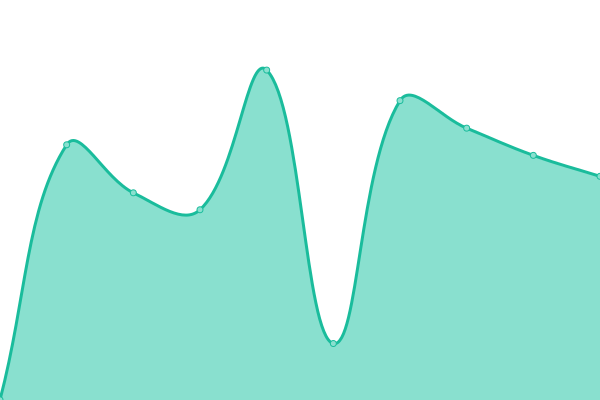

# [📈 Live Status](https://grcolombo.github.io): <!--live status--> **🟧 Partial outage**

This repository contains the open-source uptime monitor and status page for [grcolombo](https://grcolombo.github.io), powered by [Upptime](https://github.com/upptime/upptime).

With [Upptime](https://upptime.js.org), you can get your own unlimited and free uptime monitor and status page, powered entirely by a GitHub repository. We use [Issues](https://github.com/grcolombo/status-tarifar/issues) as incident reports, [Actions](https://github.com/grcolombo/status-tarifar/actions) as uptime monitors, and [Pages](https://grcolombo.github.io) for the status page.

<!--start: status pages-->
<!-- This summary is generated by Upptime (https://github.com/upptime/upptime) -->
<!-- Do not edit this manually, your changes will be overwritten -->
<!-- prettier-ignore -->
| URL | Status | History | Response Time | Uptime |
| --- | ------ | ------- | ------------- | ------ |
|  [Web Tarifar](https://web.tarifar.com) | 🟥 Down | [web-tarifar.yml](https://github.com/grcolombo/status-tarifar/commits/HEAD/history/web-tarifar.yml) | 

 2184ms
     
 | 

<a href="https://grcolombo.github.io/status-tarifar/history/web-tarifar">99.82%</a>
    

|  [App Tarifar](https://app.tarifar.com) | 🟩 Up | [app-tarifar.yml](https://github.com/grcolombo/status-tarifar/commits/HEAD/history/app-tarifar.yml) | 

 338ms
     
 | 

<a href="https://grcolombo.github.io/status-tarifar/history/app-tarifar">100.00%</a>
    

|  [Campus Tarifar](http://campus.tarifar.com/) | 🟥 Down | [campus-tarifar.yml](https://github.com/grcolombo/status-tarifar/commits/HEAD/history/campus-tarifar.yml) | 

 757ms
     
 | 

<a href="https://grcolombo.github.io/status-tarifar/history/campus-tarifar">99.83%</a>
    

<!--end: status pages-->

[**Visit our status website →**](https://grcolombo.github.io)

## 📄 License

- Powered by: [Upptime](https://github.com/upptime/upptime)
- Code: [MIT](./LICENSE) © [grcolombo](https://grcolombo.github.io)
- Data in the `./history` directory: [Open Database License](https://opendatacommons.org/licenses/odbl/1-0/)
